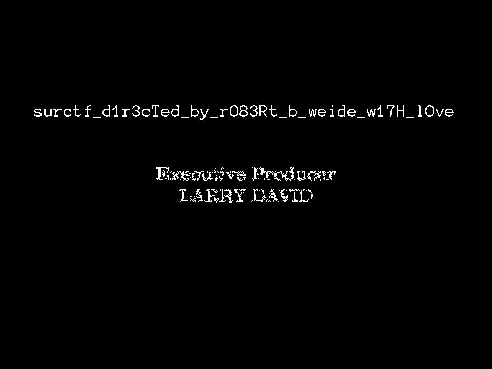

# oops!

Открываем архив - видим видео, но котором титры и вроде ничего подозрительного.

В какой-то момент вспоминаем, что видео это набор изображений. С помощью любой утилиты (например, `ffmpeg`) режем видео на кадры - получится 218 кадров.

Далее нам понадобиться `Stegsolve`. С помощью него смотрим все изображения. Немного терпения, и на 200 кадре ты достигаешь успеха.

Флаг: `surctf_d1r3cTed_by_rO83Rt_b_weide_w17H_lOve`
