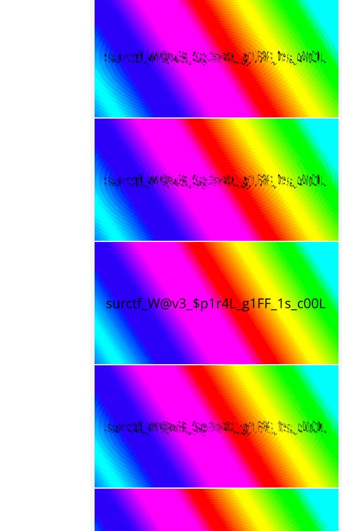

## R41NB0W 4LG43: Write-up

### Первое
Видим гифку и замечаем на ней флаг, понимаем, что просто прочитать флаг не получится.

### Второе
Пытаемся замедлить гифку и замечаем, что 1 кадр в конце гифки не искажен и найдя его мы сможем прочитать флаг.

### Третье
Пытаемся нагуглить, как можно разложить гифку по кадрам и находим к примеру сайт: https://ezgif.com/split

Находим нужный кадр и читаем флаг:

`surctf_W@v3_$p1r4L_g1FF_1s_c00L`
