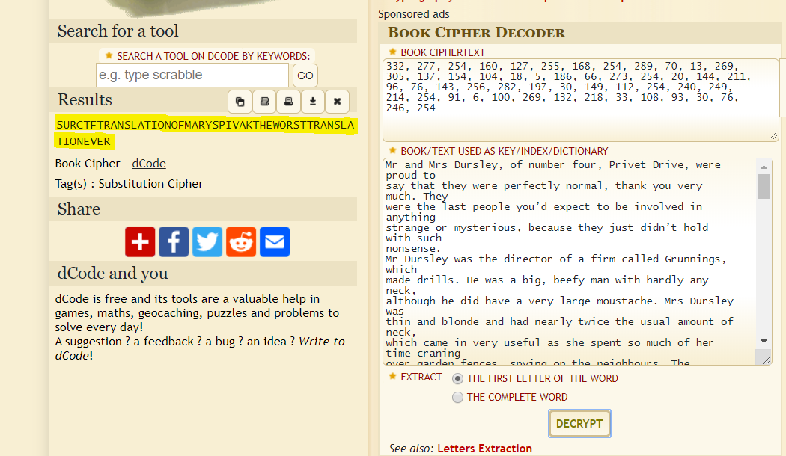

## Book of decode: Write-up

### Первое
Видим загадку, гуглим или узнаем, что это **"Гарри Поттер и философский камень"**.

### Второе
Видим много цифр через запятую, понимаем что это какой-то шифр и он связан с книгами. Гуглим книжные шифры, находим разные вариации шифров, понимаем, что скорее всего флаг будет на английском и книга нужна на английском.

### Третье
Из хинта мы понимаем какое издательство нам нужно и остается только расшифровать. Находим классный сайт, который всегда помогает в CTF: https://www.dcode.fr/book-cipher

### Четвёртое
Вставляем туда первую страницу из первой главы и шифр, получаем флаг и радуемся.

`surctf_translation_of_mary_spivak_the_worst_translation_ever`
