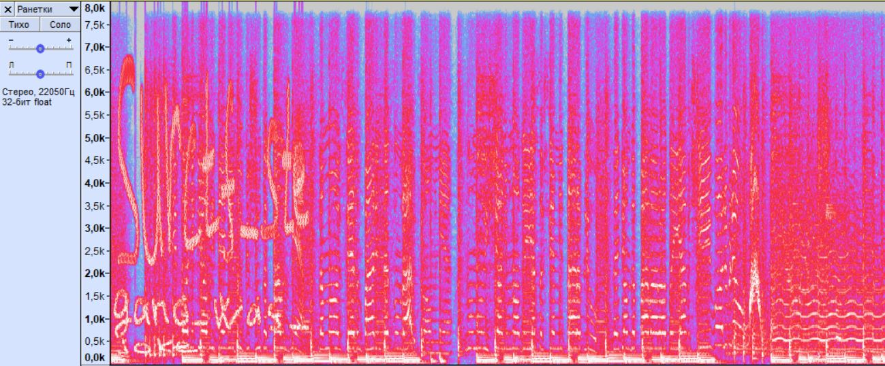

## Ranetki forever: Write-up

### Первое
Слушаем отрывок песни, слышим вначале трека помехи, понимаем, что в этом месте что-то спрятано.

### Второе
Открываем Audacity, и включаем СПЕКТОГРАММУ, видим начало флага.

### Третье
Пытаемся растянуть трек по вертикали, чтобы прочитать остальную часть флага:

`surctf_stegano_was_joke`
