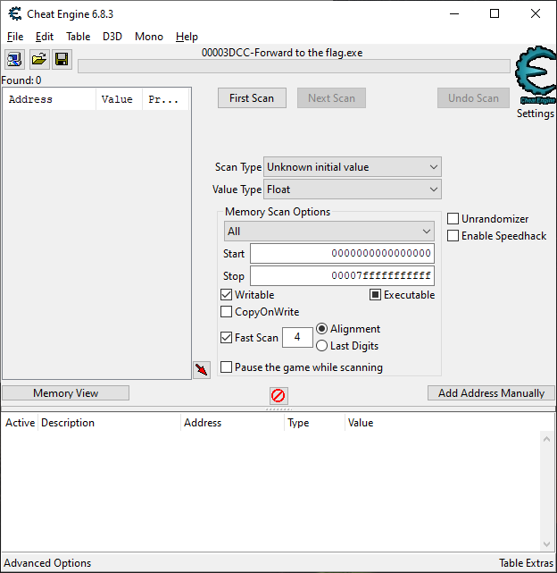
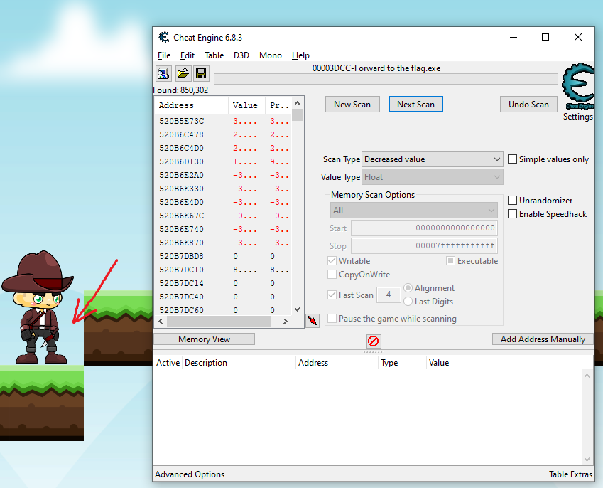
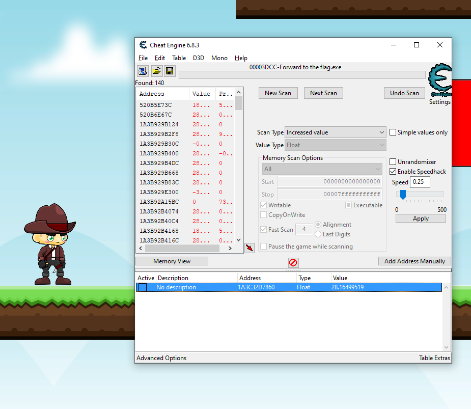
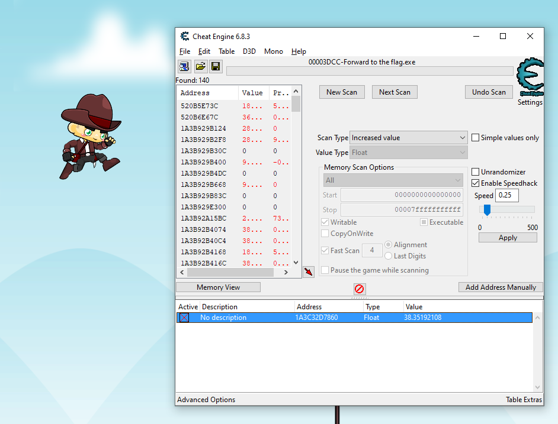
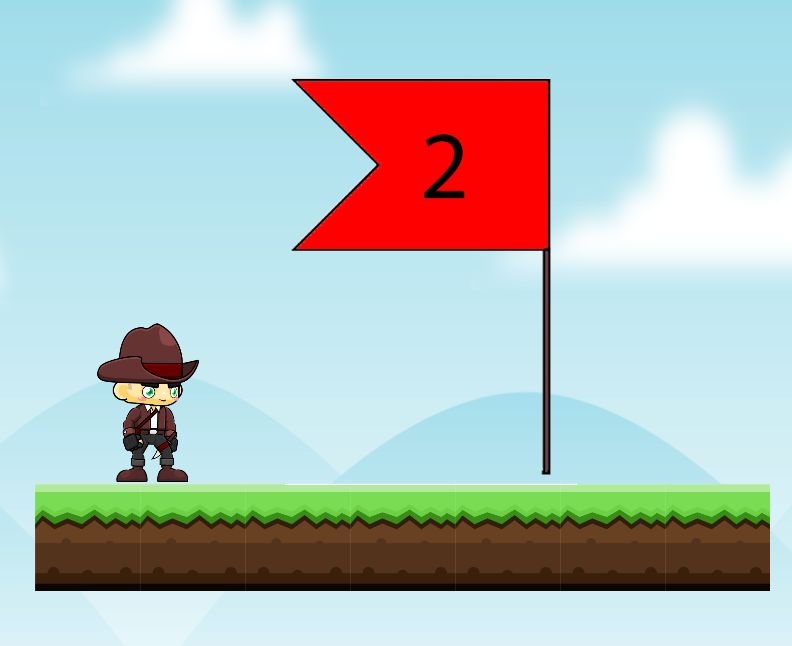

# RUN FOREST RUN #2: Write-up

Игра написана на C# без обфускации кода, поэтому есть множество вариантов решения этого таска.

## Вариант 1 (универсальный)
Используя [Cheat-Engine](https://www.cheatengine.org/) можно найти координаты игрока. Нам достаточно найти координату Y (по высоте), и для этого можно использовать способ в лоб - первый поиск делаем по неизвестному значению (Unknown initial value) типа float (в основном координаты хранятся именно в этом типе данных), далее отсеиваем значения, ставя в Scan Type пункты либо "Increased value", либо "Decreased value", заранее поднимаясь в игре на один блок выше или ниже. Отсеиваем до тех пор, пока не останется около 150 адрессов (чем меньше, тем проще) и замораживаем по несколько адресов. При заморзки нужного адреса, во время прыжка персонажа будет трясти, дополнительно можно проверить поменяв значение адреса. Теперь мы можем управлять высотой персонажа и легко добраться до флага.

Решение в картинках:

## Вариант 2
Пропатчить свойство IsGrounded в классе Character. Это свойство нужно для того, чтобы блочить возможность прыжка, когда игрок находится в воздухе. Пропатчив данное свойство, появится возможность прыгать как угодно и когда угодно.

Почитать про взлом и защиту игр на unity3d можно [тут](https://habr.com/ru/post/266345/).
